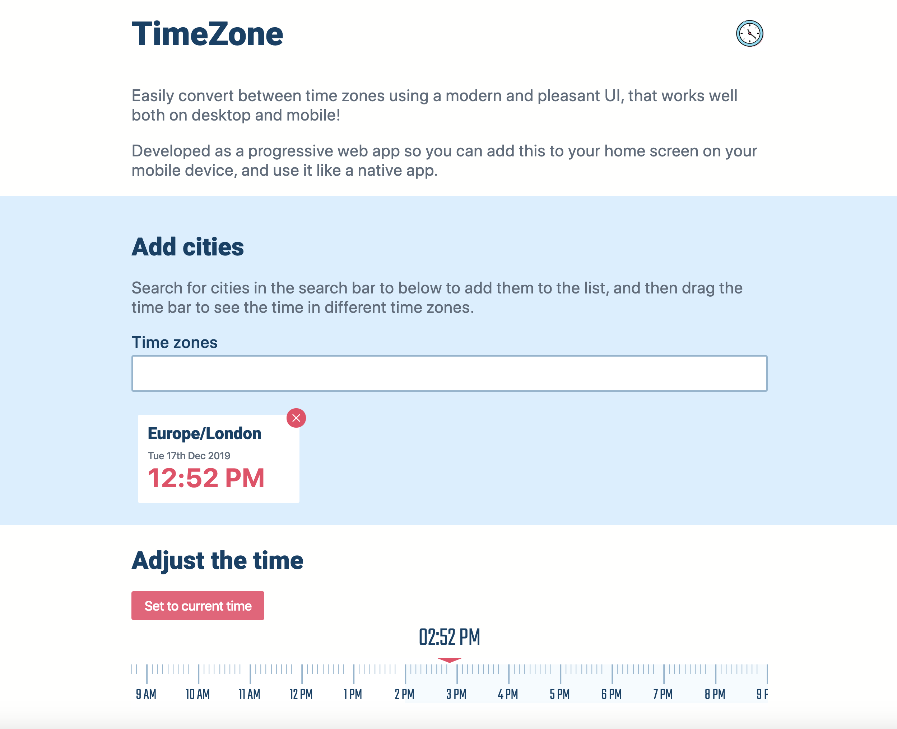

# TimeZone
[](https://app.netlify.com/sites/timezone-convert/deploys)

>   A modern progressive web app for converting between time zones, that works well on mobile and desktops




Source code for the **TimeZone** website, developed using ReactJS and deployed using Netlify.

View at [https://timezone-convert.netlify.com](https://timezone-convert.netlify.com)

## Resources
Resources used to develop site:
* [Google Fonts](https://fonts.google.com)
* [Happy Hues](https://www.happyhues.co/)
* [Zondicons](http://www.zondicons.com/)
* [Create React App](https://github.com/facebook/create-react-app)


## Deployment
```shell
$   npm install
$   npm start
```

